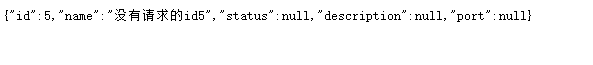

## 1.准备工作

### 1.1父工程spring-cloud

#### 1.1.1配置文件

### 1.2公共的api、bean、util等模块（spring-cloud-common)

### 1.3生产者模块(product)

#### 1.3.1pom.xml引入公共模块

```xml
         <dependency>
                    <groupId>org.springframework.boot</groupId>
                    <artifactId>spring-boot-starter-web</artifactId>
                </dependency> 
        <dependencies>
        <dependency>
            <groupId>com.jtcat</groupId>
            <artifactId>spring-cloud-common</artifactId>
            <version>0.0.1-SNAPSHOT</version>
        </dependency>
```

1.3.2配置application.properties

```properties
server.port=7001   #端口

spring.application.name= product-service    #服务名

#数据源配置
spring.datasource.url=jdbc:mysql://localhost:3306/spring_cloud
spring.datasource.username=root
spring.datasource.password=root
spring.datasource.driver-class-name=com.mysql.jdbc.Driver

```

### 1.4消费者模块(order)

#### 1.4.1配置application.properties

```properties
server.port=7002


spring.application.name=order-service  

#数据源配置
spring.datasource.url=jdbc:mysql://localhost:3306/spring_cloud
spring.datasource.username=root
spring.datasource.password=root
spring.datasource.driver-class-name=com.mysql.jdbc.Driver
```

### 1.5最终项目结构


## 2.eureka

### 2.1创建eureka项目

#### 2.1.1加入依赖

```xml
        <dependency>
            <groupId>org.springframework.cloud</groupId>
            <artifactId>spring-cloud-starter-netflix-eureka-server</artifactId>
        </dependency>
```

#### 2.1.2配置application.properties

```properties
server.port=9000

spring.application.name=eureka-server

#主机地址
eureka.instance.hostname=localhost
#是否将自己注册到注册中心
eureka.client.register-with-eureka=false
#是否从注册中心获取信息
eureka.client.fetch-registry=false
#暴露给eureka client的地址
eureka.client.service-url.defaultZone=http://${eureka.instance.hostname}:${server.port}/eureka/
```

#### 2.1.3编写启动类

```java
@SpringBootApplication
@EnableEurekaServer
public class EurekaApplication {
    public static void main(String[] args) {

        SpringApplication.run(EurekaApplication.class,args);
    }
}
```

#### 2.1.4启动并输入localhost:9000出现下图则成功


### 2.2将product和order模块注册到eureka

#### 2.2.1两个项目都加入依赖

```xml
        <dependency>
            <groupId>org.springframework.cloud</groupId>
            <artifactId>spring-cloud-starter-netflix-eureka-client</artifactId>
        </dependency>
```


#### 2.2.2配置文件都添加如下配置

```:nine:
#eureka server 的地址
eureka.client.service-url.defaultZone=http://localhost:9000/eureka
#使用ip注册
eureka.instance.prefer-ip-address=true
```

#### 2.2.3localhost:9000出现下图则成功


### 2.3搭建eureka集群（以3个为例）如下图


#### 2.3.1给新创建的2个eureka server 加入依赖

```:nine:
        <dependency>
            <groupId>org.springframework.cloud</groupId>
            <artifactId>spring-cloud-starter-netflix-eureka-server</artifactId>
        </dependency>
```

#### 2.3.2修改3个配置文件，以此为

eureka

```properties
server.port=9000

spring.application.name=eureka-server

#主机地址
eureka.instance.hostname=localhost
#是否将自己注册到注册中心
eureka.client.register-with-eureka=true
#是否从注册中心获取信息
eureka.client.fetch-registry=true
#暴露给eureka client的地址
eureka.client.service-url.defaultZone=http://localhost:9003/eureka,http://localhost:9002/eureka
```

eureka-2

```properties
server.port=9002

spring.application.name=eureka-server

#主机地址
eureka.instance.hostname=localhost
#是否将自己注册到注册中心
eureka.client.register-with-eureka=true
#是否从注册中心获取信息
eureka.client.fetch-registry=true
#暴露给eureka client的地址
eureka.client.service-url.defaultZone=http://localhost:9000/eureka,http://localhost:9003/eureka


```

eureka-3

```properties
server.port=9003

spring.application.name=eureka-server

#主机地址
eureka.instance.hostname=localhost
#是否将自己注册到注册中心
eureka.client.register-with-eureka=true
#是否从注册中心获取信息
eureka.client.fetch-registry=true
#暴露给eureka client的地址
eureka.client.service-url.defaultZone=http://localhost:9000/eureka,http://localhost:9002/eureka
```

#### 2.3.3修改product和order的配置文件

product

```properties
server.port=7001
#服务名
spring.application.name=product-service  

#数据源配置
spring.datasource.url=jdbc:mysql://localhost:3306/spring_cloud
spring.datasource.username=root
spring.datasource.password=root
spring.datasource.driver-class-name=com.mysql.jdbc.Driver

#eureka server 的地址
eureka.client.service-url.defaultZone=http://localhost:9000/eureka,http://localhost:9002/eureka,http://localhost:9003/eureka
#使用ip注册
eureka.instance.prefer-ip-address=true

```

order

```properties
server.port=7002

spring.application.name=order-service  

#数据源配置
spring.datasource.url=jdbc:mysql://localhost:3306/spring_cloud
spring.datasource.username=root
spring.datasource.password=root
spring.datasource.driver-class-name=com.mysql.jdbc.Driver
#eureka server 的地址
eureka.client.service-url.defaultZone=http://localhost:9000/eureka,http://localhost:9002/eureka,http://localhost:9003/eureka
#使用ip注册
eureka.instance.prefer-ip-address=true

```

#### 2.3.4启动项目打开3个eureka的链接，出现下图情况，成功


#### 2.4eureka原理


## 3.ribbon

### 3.1创建product-2模块，除了端口与product不一样外，其他都一样

### 3.2在order项目中添加RestTemplate的bean，

```:nine:
  @Bean
    @LoadBalanced
    public RestTemplate restTemplate(){
        return new RestTemplate();
    }
```

### 3.3在OrderController中注入RestTemplate，使用product的服务名调用服务即可达到负载均衡的效果

```:nine:
@Autowired
    RestTemplate restTemplate;
    String URL="http://product-service/product/";
    @GetMapping("/{id}")
    public Product getProductById(@PathVariable("id") Integer id){
        return restTemplate.getForObject(URL  + id,Product.class);
    }
    @GetMapping("/all")
    public List<Product> getAll(){
        return restTemplate.getForObject(URL + "all",List.class);
    }
```

### 3.4ribbon源码分析


## 4feign

### 4.1feign与ribbon同样是用于负载均衡，ribbon是通过发送http请求，feign是通过调用接口的方式

### 4.2在order项目中编写一个FeignService

```:nine:
@FeignClient("product-service")
public interface FeignService {
    @GetMapping("/product/{id}")
    public Product findById(@PathVariable("id") Integer id);

    @GetMapping("/product/all")
    public List<Product> findall();

}
```

### 4.3修改OrderController

```:nine:
  @Autowired
   FeignService feignService;
   @GetMapping("/{id}")
   public Product getById(@PathVariable("id") Integer id){
      return feignService.findById(id);
   }

   @GetMapping("/all")
    public  List<Product> getAll(){
       return feignService.findall();
   }
```


### 4.4启动类上添加注解@EnableFeignClients

```:nine:
@SpringBootApplication
@EnableFeignClients
public class OrderApplication {
    public static void main(String[] args) {
        SpringApplication.run(OrderApplication.class,args);
    }


    @Bean
    @LoadBalanced
    public RestTemplate restTemplate(){
        return new RestTemplate();
    }
}
```

### 4.5源码分析


## 5.hystrix服务熔断降级

### 5.1基于RestTemplate的熔断

#### 5.1.1给product加入依赖

```xml
<dependency>
            <groupId>org.springframework.cloud</groupId>
            <artifactId>spring-cloud-starter-netflix-hystrix</artifactId>
        </dependency>
```

#### 5.1.2修改product模块

使用@HystrixCommand(fallbackMethod = "getProductByIdFallBack")标注需要熔断的方法并制定方法名getProductByIdFallBack，当目标方法出现异常时就会跳转到降级方法。（降级方法要和目标方法的返回值、参数相同）

```java
    @GetMapping("/{id}")
    @HystrixCommand(fallbackMethod = "getProductByIdFallBack")
    public Product getOrderById(@PathVariable("id") Integer id){
        if(id >4){
            throw  new RuntimeException("id不合法");
        }
        Product product = productService.findById(id);
        product.setPort(port);
        return product;
    }
    public  Product  getProductByIdFallBack(@PathVariable("id") Integer id){
        Product product = new Product();
        product.setId(id);
        product.setName("没有请求的id" + id);
        return product;
    }
```

#### 5.1.3在启动类上添加注解@EnableCircuitBreaker

```java
@SpringBootApplication
@MapperScan("com.jtcat.mapper")
@EnableCircuitBreaker
public class ProductApplication {
    public static void main(String[] args) {
        SpringApplication.run(ProductApplication.class,args);
    }
}

```

#### 5.14启动项目并打开链接http://localhost:7001/product/5则会出现（启动的是product）



### 5.2基于RestTemplate的统一降级方法

#### 5.2.1只需要将ProductController类上添加注解

#### @DefaultProperties(defaultFallback = "defaultFallBack")并制定降级方法

#### defaultFallBack即可

```java
@RestController
@RequestMapping("/product")
@DefaultProperties(defaultFallback = "defaultFallBack")
public class ProductController {

    @Autowired
    ProductService productService;
    @Value("${server.port}")
    String port;
    @GetMapping("/{id}")
    @HystrixCommand//(fallbackMethod = "getProductByIdFallBack")
    public Product getOrderById(@PathVariable("id") Integer id){
        if(id >4){
            throw  new RuntimeException("id不合法");
        }
        Product product = productService.findById(id);
        product.setPort(port);
        return product;
    }
    public  Product  getProductByIdFallBack(@PathVariable("id") Integer id){
        Product product = new Product();
        product.setId(id);
        product.setName("没有请求的id" + id);
        return product;
    }
    /*
    *统一降级方法不需要参数，但是返回值必须要和目标方法一样，但是controller中有多种方法
    * ，返回值不一定相同。如果使用这种方法时，就要统一指定返回值了
    *  这种方法只对方法上标注了@HystrixCommand有效
    */

    public Product defaultFallBack(){
        Product product = new Product();
        product.setName("统一降级方法");
        return product;
    }
    @GetMapping("/all")
    public List<Product> getAll(){
        return productService.findAll();
    }
}

```

### 5.3基于feign的熔断

#### 5.3.1在order配置文件中添加feign对于hytrix的支持

```properties
#开启feign对于hytrix的支持
feign.hystrix.enabled=true
```

#### 5.3.2在order模块中添加一个类实现并加入到容器中

```java
@Component
public class FeignHytrixIpml implements FallbackFactory<FeignService> {
    @Override
    public FeignService create(Throwable throwable) {
        return new FeignService() {
            @Override
            public Product findById(Integer id) {
                Product product= new Product();
                product.setId(id);
                product.setName("Hytrix基于feign的降级服务");
                return product;
            }

            @Override
            public List<Product> findall() {
                return null;
            }
        };
    }
}
```

#### 5.3.3在FeignServcice中添加注解

@FeignClient(value="product-service" ,fallbackFactory = FeignHystrixIpml.class)

```java
@FeignClient(value="product-service" ,fallbackFactory = FeignHytrixIpml.class)
public interface FeignService {
    @GetMapping("/product/{id}")
    public Product findById(@PathVariable("id") Integer id);

    @GetMapping("/product/all")
    public List<Product> findall();
    
}

```

#### 5.3.4启动并打开链接http://localhost:8001/order/5  （商品模块启动product-2）


#### 5.4hystrix  dashboard

#### 5.4.1新建模块hystrix-dashboard

#### 5.4.2添加依赖

```xml
<dependency>
            <groupId>org.springframework.cloud</groupId>
            <artifactId>spring-cloud-starter-netflix-eureka-client</artifactId>

        </dependency>
        <dependency>
            <groupId>org.springframework.cloud</groupId>
            <artifactId>spring-cloud-starter-netflix-hystrix</artifactId>
        </dependency>
        <dependency>
            <groupId>org.springframework.boot</groupId>
            <artifactId>spring-boot-starter-actuator</artifactId>
        </dependency>
        <dependency>
            <groupId>org.springframework.cloud</groupId>
            <artifactId>spring-cloud-starter-netflix-hystrix-dashboard</artifactId>
        </dependency>
    </dependencies>
```

#### 5.4.3添加配置及启动类

```properties
server.port=10000

spring.application.name=hystrix-dashboard
eureka.client.service-url.defaultZone=http://localhost:9000/eureka
#使用ip注册
eureka.instance.prefer-ip-address=true
#在注册中心中显示ip地址和端口
eureka.instance.instance-id=${spring.cloud.client.ip-address}:${server.port}

management.endpoints.web.exposure.include=*
```

```java
@SpringBootApplication
@EnableHystrixDashboard
@EnableCircuitBreaker
@EnableEurekaClient
public class HystrixApplication {
    public static void main(String[] args) {
        SpringApplication.run(HystrixApplication.class,args);
    }
}
```


#### 5.4.4修改order项目和product-2

##### 5.4.4.1同样添加上面的依赖并添加配置

```properties
management.endpoints.web.exposure.include=*
```


#### 5.4.6登录


### 5.5turbine

#### 5.5.1使用turbine监控所有服务的状况（为了方便起见与hystrix-dashboard配置在一个项目中）

#### 5.5.2添加依赖

```xml
       <dependency>
            <groupId>org.springframework.cloud</groupId>
            <artifactId>spring-cloud-starter-netflix-turbine</artifactId>
        </dependency>
```

#### 5.5.3修改配置类

```properties
#受监控的服务，多个之间用“，”隔开
turbine.app-config=order-service
#turbine.aggregator.cluster-config=default
#turbine.aggregator.default=actuator/hystrix.stream
turbine.cluster-name-expression=new String("default")

```

#### 5.5.4启动类添加注解

```java
@SpringBootApplication
@EnableHystrixDashboard
@EnableCircuitBreaker
@EnableEurekaClient
@EnableTurbine
public class HystrixApplication {
    public static void main(String[] args) {
        SpringApplication.run(HystrixApplication.class,args);
    }
}

```

#### 5.5.5启动


## 6zuul

### 6.1创建项目zuul-server

### 6.2添加依赖

```xml
         <dependency>
            <groupId>org.springframework.cloud</groupId>
            <artifactId>spring-cloud-starter-netflix-eureka-client</artifactId>
        </dependency>
        <dependency>
            <groupId>org.springframework.cloud</groupId>
            <artifactId>spring-cloud-starter-netflix-zuul</artifactId>

        </dependency>
```

#### 6.3修改配置文件

```properties
server.port=11001

spring.application.name=zuul-server
eureka.client.service-url.defaultZone=http://localhost:9000/eureka
#使用ip注册
eureka.instance.prefer-ip-address=true
#在注册中心中显示ip地址和端口
eureka.instance.instance-id=${spring.cloud.client.ip-address}:${server.port}


#访问路径
zuul.routes.order.path=/order-service1/**
#跳转到order-service服务的/**地址
zuul.routes.order.service-id=order-service
zuul.routes.product.path=/product-service1/**
zuul.routes.product.service-id=product-service
```

#### 6.4启动类

```java
//如果启动类上不添加@EnableEurekaClient,spring也会添加上
@EnableZuulProxy
@SpringBootApplication
public class ZuulApplication {
    public static void main(String[] args) {
        SpringApplication.run(ZuulApplication.class,args);
    }
}
```

